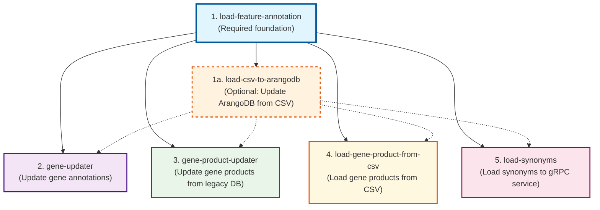

### Feature Annotation CLI
A command-line application for managing feature annotations with support for loading data from various sources and updating gene information.

## Execution Sequence

The feature annotation subcommands should be executed in the following sequence, with all commands depending on the initial `load-feature-annotation`:



**Legend:**
- **Solid arrows**: Required dependencies
- **Dashed arrows**: Optional sequence (if step 1a is executed)
- **Blue**: Foundation command (must run first)
- **Orange**: Data loading/updating commands
- **Purple/Green/Pink**: Processing and enhancement commands

## Table of Contents
- [load-feature-annotation](#load-feature-annotation) - Load feature annotations from ArangoDB to gRPC service
- [load-csv-to-arangodb](#load-csv-to-arangodb) - Update ArangoDB collection from CSV file
- [gene-updater](#gene-updater) - Update gene annotations by stripping HTML and using gRPC
- [gene-product-updater](#gene-product-updater) - Update gene products from legacy database
- [load-gene-product-from-csv](#load-gene-product-from-csv) - Load gene products from CSV files
- [load-synonyms](#load-synonyms) - Load synonyms from ArangoDB to gRPC service

---

#### `load-feature-annotation`
This subcommand loads feature annotations from an ArangoDB instance into the feature annotation service via gRPC.

**Usage:**
```bash
featureannotation load-feature-annotation [command options]
```

**Options:**
| Flag | Description | Environment Variable | Default | Required |
|---|---|---|---|---|
| `--arangodb-user` | ArangoDB user name | `ARANGODB_USER` | | Yes |
| `--arangodb-pass` | ArangoDB password | `ARANGODB_PASS` | | Yes |
| `--arangodb-database` | ArangoDB database name | `ARANGODB_DATABASE` | | Yes |
| `--arangodb-host` | ArangoDB host | `ARANGODB_SERVICE_HOST` | `arangodb` | No |
| `--arangodb-port` | ArangoDB port | `ARANGODB_SERVICE_PORT` | `8529` | No |
| `--is-secure` | Use TLS for ArangoDB connection | `ARANGODB_IS_SECURE` | `false` | No |
| `--feature-annotation-grpc-host` | Feature annotation gRPC host | `ANNO_FEAT_API_SERVICE_HOST` | `anno-feat-api` | No |
| `--feature-annotation-grpc-port` | Feature annotation gRPC port | `ANNO_FEAT_API_SERVICE_PORT` | `9250` | No |
| `--pubmed-workers` | Number of pubmed fetcher workers | `PUBMED_WORKERS` | `4` | No |
| `--grpc-workers` | Number of gRPC create workers | `GRPC_WORKERS` | `8` | No |

---

#### `load-csv-to-arangodb`
This subcommand updates an ArangoDB collection from a CSV file.

**Usage:**
```bash
featureannotation load-csv-to-arangodb [command options]
```

**Options:**
| Flag | Description | Environment Variable | Default | Required |
|---|---|---|---|---|
| `--csv-file` | Path to CSV file to load | | | Yes |
| `--collection` | ArangoDB collection name | | `featureprop` | No |
| `--delimiter` | CSV delimiter character | | `,` | No |
| `--batch-size` | Documents to update per batch | | `40` | No |
| `--workers` | Concurrent workers for batching | | `4` | No |
| `--arangodb-user` | ArangoDB user name | `ARANGODB_USER` | | Yes |
| `--arangodb-pass` | ArangoDB password | `ARANGODB_PASS` | | Yes |
| `--arangodb-database` | ArangoDB database name | `ARANGODB_DATABASE` | | Yes |
| `--arangodb-host` | ArangoDB host | `ARANGODB_SERVICE_HOST` | `arangodb` | No |
| `--arangodb-port` | ArangoDB port | `ARANGODB_SERVICE_PORT` | `8529` | No |
| `--is-secure` | Use TLS for ArangoDB connection | `ARANGODB_IS_SECURE` | `false` | No |

---

#### `gene-updater`
This subcommand updates gene annotations by stripping HTML from properties and using a gRPC API.

**Usage:**
```bash
featureannotation gene-updater [command options]
```

**Options:**
| Flag | Description | Environment Variable | Default | Required |
|---|---|---|---|---|
| `--aql-query` | AQL query to fetch gene data | `AQL_QUERY` | (See source) | No |
| `--processing-workers`| HTML processing workers | `PROCESSING_WORKERS` | `4` | No |
| `--grpc-workers` | gRPC update workers | `GRPC_WORKERS` | `8` | No |
| `--arangodb-user` | ArangoDB user name | `ARANGODB_USER` | | Yes |
| `--arangodb-pass` | ArangoDB password | `ARANGODB_PASS` | | Yes |
| `--arangodb-database` | ArangoDB database name | `ARANGODB_DATABASE` | | Yes |
| `--arangodb-host` | ArangoDB host | `ARANGODB_SERVICE_HOST` | `arangodb` | No |
| `--arangodb-port` | ArangoDB port | `ARANGODB_SERVICE_PORT` | `8529` | No |
| `--is-secure` | Use TLS for ArangoDB connection | `ARANGODB_IS_SECURE` | `false` | No |
| `--feature-annotation-grpc-host` | Feature annotation gRPC host | `ANNO_FEAT_API_SERVICE_HOST` | `anno-feat-api` | No |
| `--feature-annotation-grpc-port` | Feature annotation gRPC port | `ANNO_FEAT_API_SERVICE_PORT` | `9250` | No |

---

#### `gene-product-updater`
This subcommand updates gene products from a legacy database to the feature annotation service.

**Usage:**
```bash
featureannotation gene-product-updater [command options]
```

**Options:**
| Flag | Description | Environment Variable | Default | Required |
|---|---|---|---|---|
| `--legacy-database` | Legacy database name | `LEGACY_DATABASE` | `cgm_ddb` | No |
| `--legacy-workers` | Legacy DB query workers | `LEGACY_WORKERS` | `4` | No |
| `--grpc-workers` | gRPC update workers | `GRPC_WORKERS` | `8` | No |
| `--arangodb-user` | ArangoDB user name | `ARANGODB_USER` | | Yes |
| `--arangodb-pass` | ArangoDB password | `ARANGODB_PASS` | | Yes |
| `--arangodb-database` | ArangoDB database name | `ARANGODB_DATABASE` | | Yes |
| `--arangodb-host` | ArangoDB host | `ARANGODB_SERVICE_HOST` | `arangodb` | No |
| `--arangodb-port` | ArangoDB port | `ARANGODB_SERVICE_PORT` | `8529` | No |
| `--is-secure` | Use TLS for ArangoDB connection | `ARANGODB_IS_SECURE` | `false` | No |
| `--feature-annotation-grpc-host` | Feature annotation gRPC host | `ANNO_FEAT_API_SERVICE_HOST` | `anno-feat-api` | No |
| `--feature-annotation-grpc-port` | Feature annotation gRPC port | `ANNO_FEAT_API_SERVICE_PORT` | `9250` | No |

---

#### `load-gene-product-from-csv`
This subcommand loads gene products from CSV files into the feature annotation service.

**Usage:**
```bash
featureannotation load-gene-product-from-csv [command options]
```

**Options:**
| Flag | Description | Environment Variable | Default | Required |
|---|---|---|---|---|
| `--input`, `-i` | One or more input CSV files with gene products | | | Yes |
| `--workers` | Number of concurrent workers for loading | | `4` | No |
| `--batch-size` | Batch size for loading | | `100` | No |
| `--user` | Email of the user running the load | | | Yes |
| `--feature-annotation-grpc-host` | Feature annotation gRPC host | `ANNO_FEAT_API_SERVICE_HOST` | `anno-feat-api` | No |
| `--feature-annotation-grpc-port` | Feature annotation gRPC port | `ANNO_FEAT_API_SERVICE_PORT` | `9250` | No |

---

#### `load-synonyms`
This subcommand loads synonyms from ArangoDB to the feature annotation service.

**Usage:**
```bash
featureannotation load-synonyms [command options]
```

**Options:**
| Flag | Description | Environment Variable | Default | Required |
|---|---|---|---|---|
| `--arangodb-user` | ArangoDB user name | `ARANGODB_USER` | | Yes |
| `--arangodb-pass` | ArangoDB password | `ARANGODB_PASS` | | Yes |
| `--arangodb-database` | ArangoDB database name | `ARANGODB_DATABASE` | | Yes |
| `--arangodb-host` | ArangoDB host | `ARANGODB_SERVICE_HOST` | `arangodb` | No |
| `--arangodb-port` | ArangoDB port | `ARANGODB_SERVICE_PORT` | `8529` | No |
| `--is-secure` | Use TLS for ArangoDB connection | `ARANGODB_IS_SECURE` | `false` | No |
| `--feature-annotation-grpc-host` | Feature annotation gRPC host | `ANNO_FEAT_API_SERVICE_HOST` | `anno-feat-api` | No |
| `--feature-annotation-grpc-port` | Feature annotation gRPC port | `ANNO_FEAT_API_SERVICE_PORT` | `9250` | No |
| `--grpc-workers` | Number of gRPC update workers | `GRPC_WORKERS` | `4` | No |
